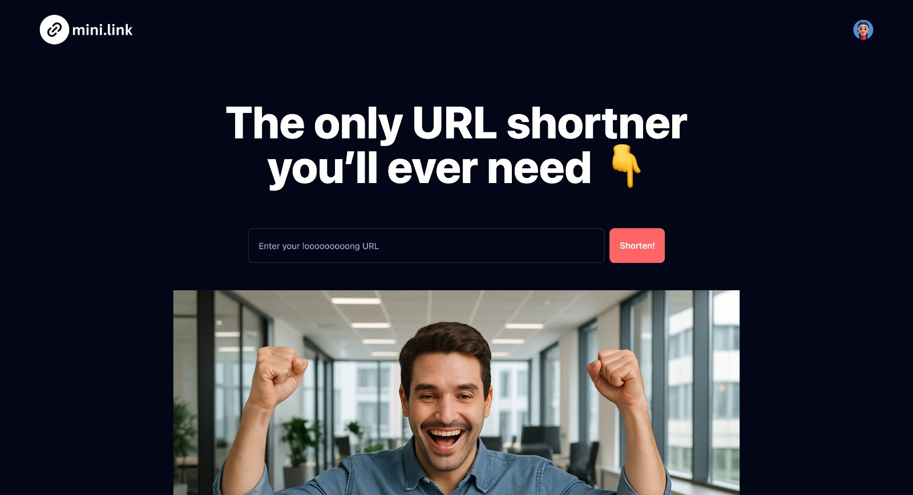
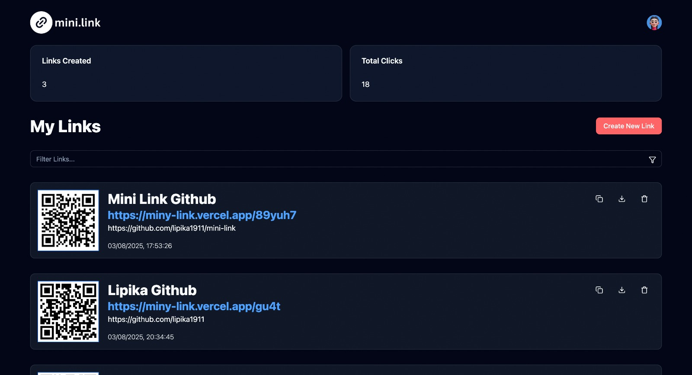
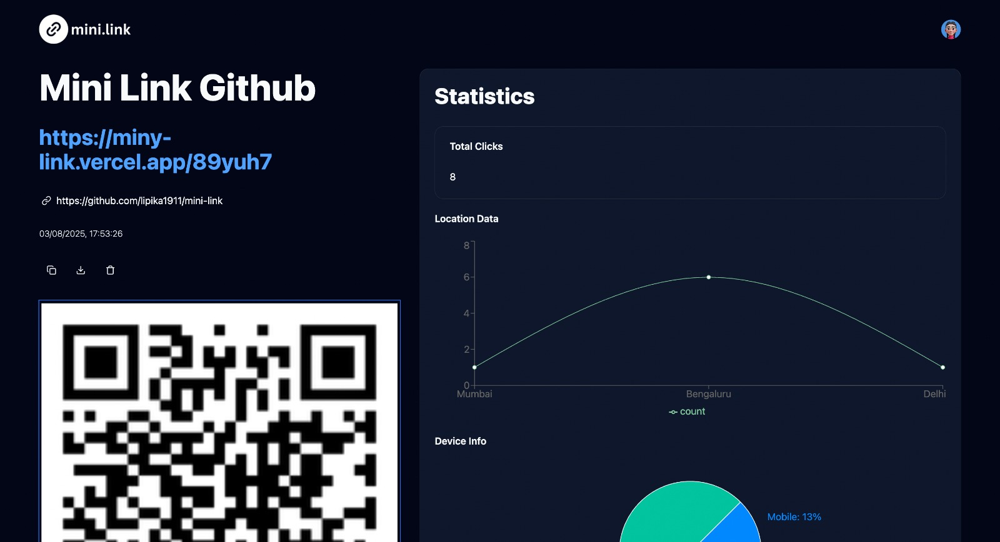

# 🔗 mini.link

**mini.link** is a modern URL shortener app that lets users create short links, track click analytics, and manage QR codes — all with a clean and responsive UI. Built using **React + Vite**, **Supabase**, and **Tailwind CSS**, it offers real-time link stats, device detection, and a smooth dashboard experience.


## 💻 Deployed App

👉 [Try it live!](https://miny-link.vercel.app/)

## 📸 Preview

### 📌 Landing Page


### 📌 Dashboard


### 📌 Link Analytics Page


## 🛠️ Tech Stack

- **Frontend:** React + Vite, Tailwind CSS, ShadCN UI  
- **Backend-as-a-Service:** Supabase (auth, database, API)  
- **QR Code Generation:** [react-qrcode](https://github.com/zpao/qrcode.react)  
- **Validation:** Yup  
- **Analytics Charts:** Recharts  
               


## ✨ Features

- 🌐 **Landing Page** – Includes FAQs and intro to the app  
- 🔐 **Authentication** – Sign in and Sign up using Supabase  
- 🧩 **Dashboard** – Manage your short links  
  - Copy short link  
  - Download QR code  
  - Delete link  
- 📊 **Analytics Page** – Track link performance with:
  - Number of clicks  
  - Visitor location (country)  
  - Device type (desktop, mobile, tablet)  
- 📎 **QR Code Support** – Every short link gets a downloadable QR code


## 📦 Installation Guide

### ✅ Prerequisites

Before you begin, make sure you have:

- **Node.js** (v18 or later) – [Download](https://nodejs.org/)
- **npm** or **yarn**
- **Supabase project** – [Create one](https://supabase.com/)

### ⚙️ Clone the Repository

```bash
git clone https://github.com/lipika1911/mini-link.git
```

### 🔌 Install Dependencies

```bash
npm install
```

### 📝 Environment Variables

Create a .env file in root directory and configure the following:

```env
VITE_SUPABASE_URL=your_supabase_url
VITE_SUPABASE_ANON_KEY=your_supabase_anon_key
VITE_BASE_URL = your_vite_base_url
```
### 🏃 Run the App

```bash
npm run dev
```

### ✅ You’re all set!
- Open http://localhost:5173 in your browser.
- Register a new user and start using Bloggr!
## 📬 Contact

For feedback, ideas, or collaborations, reach out:

- 💻 **GitHub:** [lipika1911](https://github.com/lipika1911)

## 📄 License

This project is licensed under the [MIT License](./LICENSE).


## 👩‍💻 About the Developer

Made with ❤️ by [Lipika](https://github.com/lipika1911)
